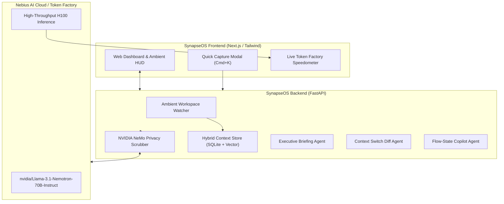

# SynapseOS 🧠⚡

> **Ambient Cognitive Copilot & Contextual Second Brain**  
> *Built for the **Nebius x NVIDIA Global AI Hackathon 2026** — Track: **Personal AI***

[](https://studio.nebius.ai/)
[](https://build.nvidia.com/)
[](https://nebiusglobalaihackathon.devpost.com/)

---

## 💡 Overview

Most personal AI assistants today are **passive chat bots**: they wait dormant until prompted, possess no awareness of your active workspace, and cause cognitive friction as you constantly re-explain context.

**SynapseOS** is an **ambient, proactive personal AI copilot** that maintains your flow state by bridging workspace context, thoughts, and high-speed reasoning:

- **Ambient Context Ingestion**: Silently indexes active workspace files, markdown notes, code diffs, and quick captures.
- **Ultra-Fast Streaming via Nebius Token Factory**: Powers continuous reasoning with `nvidia/Llama-3.1-Nemotron-70B-Instruct` on Nebius H100/H200 infrastructure at hundreds of tokens per second.
- **NVIDIA NeMo Privacy Guardrails**: Enforces local-first PII and secret redaction—ensuring API keys and personal data are never leaked to the cloud.
- **Proactive Executive Briefings**: Starts your morning and work sessions with synthesized priorities, open loops, and context-switch diffs.
- **Flow-State Thought Partner**: Instant, streaming deep-work assistance with interactive telemetry meters showing real-time token speeds.

---

## 🏛️ Architecture



---

## 🚀 Key Features

1. **Executive Morning Briefing & Session Kickoff**: Synthesizes what you were working on yesterday, unresolved threads, and high-leverage priorities for today.
2. **Context Switch Diff**: When switching between projects or tasks, SynapseOS computes a 3-bullet recap of where you left off.
3. **Ambient Memory Graph**: Inspect your contextual second brain in real-time.
4. **Local-First Privacy**: NeMo Guardrail pipeline sanitizes API keys and PII on your local machine before cloud transmission.
5. **Real-Time Token Throughput Gauge**: Showcases Nebius Token Factory's inference speed (tokens/sec, TTFT) right inside the UI.

---

## 🛠️ Quickstart

### Prerequisites
- Python 3.11+
- Node.js 18+
- Nebius AI Studio API Key ([https://studio.nebius.ai/](https://studio.nebius.ai/))

### 1. Configuration
```bash
cp .env.example .env
# Edit .env with your NEBIUS_API_KEY
```

### 2. Run Backend
```bash
cd backend
python3 -m venv venv
source venv/bin/activate
pip install -r requirements.txt
python -m app.main
```

### 3. Run Frontend
```bash
cd frontend
npm install
npm run dev
```

---

## 🏆 Hackathon Submission Details

- **Event**: Nebius x NVIDIA Global AI Hackathon 2026
- **Track**: Personal AI
- **Models**: `nvidia/Llama-3.1-Nemotron-70B-Instruct`
- **Infrastructure**: Nebius AI Cloud (Token Factory)
- **Portal**: [https://nebiusglobalaihackathon.devpost.com/](https://nebiusglobalaihackathon.devpost.com/)
